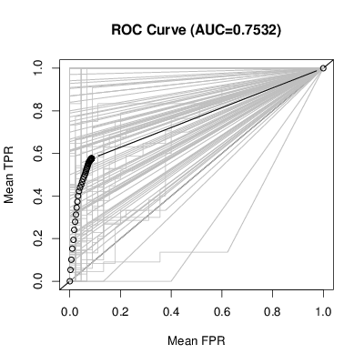
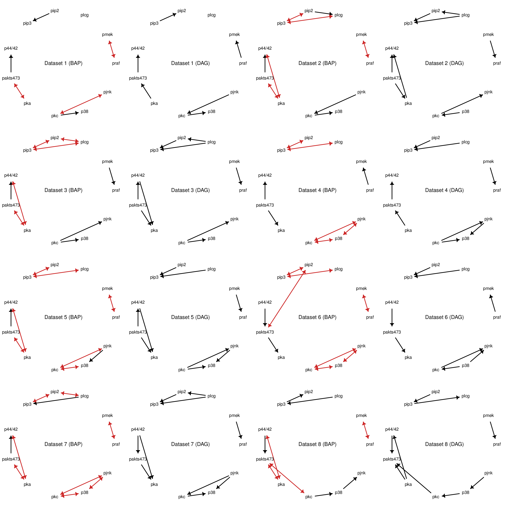

This is a fork of the `greedyBAPs` package, implementing a search space restriction to arid graphs and maximal arid graphs.
The original greedyBAPs algorithm is described by Nozohour, Maathuis, Evans & Bühlmann. For definitions of graph aridity, maximality, and the maximal arid projection, see Shpitser, Evans & Richardson (2018).

* Nowzohour, C., Maathuis, M. H., Evans, R. J., & Bühlmann, P. (2017). Distri-
butional equivalence and structure learning for bow-free acyclic path dia-
grams. Electronic Journal of Statistics, 11 (2), 5342–5374. doi:https://www.doi.org/10.1214/17-EJS1372
* Shpitser, I., Evans, R. J., & Richardson, T. S. (2018). Acyclic linear sems obey the nested markov property. In *Proceedings of the 34th conference on un-
certainty in artificial intelligence (uai)*.

The original README of `greedyBAPs` is below.

# greedyBAPs

The `greedyBAPs` package contains code to do structure learning in a specific family of graphical models (bow-free acyclic path diagrams or BAPs) via a greedy algorithm. Simply put, it tries to find the best-fitting BAP given some data. For more information about BAPs and some applications of this package, see the paper at https://arxiv.org/abs/1508.01717.

## Installing

You can install this package directly from github using the `devtools` package:
```
devtools::install_github("cnowzohour/greedyBAPs")
```

## Using

For an introduction of how to use this package have a look at the [package vignette](vignettes/greedyBAPs.Rmd) (view in RStudio for best experience).

## Figures from the paper

The paper referenced above contains two figures created using this package:

* Causal effects simulation (created using [inst/generateFigure_simulation.R](inst/generateFigure_simulation.R))

* BAPs vs DAGs on genomic data (created using [inst/generateFigure_genomic.R](inst/generateFigure_genomic.R))

